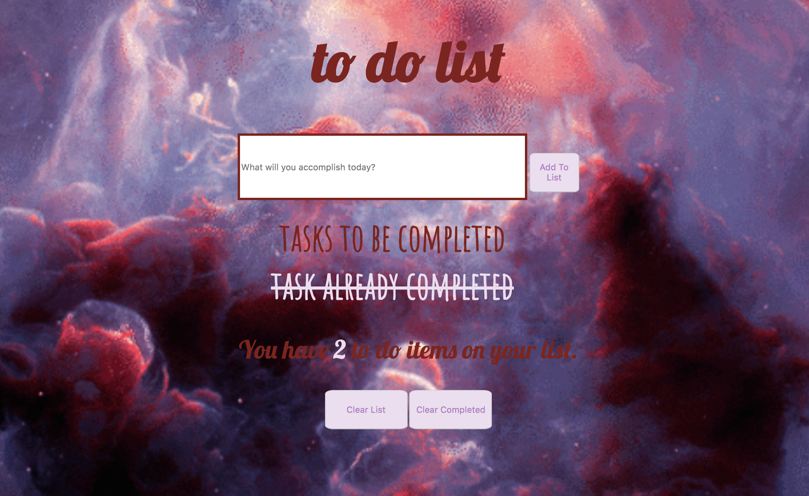

# To Do List
This a full stack application. Users can add tasks to their list and the counter will notify the user of how many tasks are on their list. Once the tasks are complete, users can cross them off the list or delete them. They also have the ability to delete the entire list once every task is complete.

## How it's made:
**Tech Used** I used ES6, an HTML template file CSS, Node.js, MongoDB and Express.js.

## Lesson Learned
I learned how to take a previously functioning application and convert it into a full tack server side application. I have been working more with full stack applications and it has been so much fun learning how to interact and pull data from a database. 
